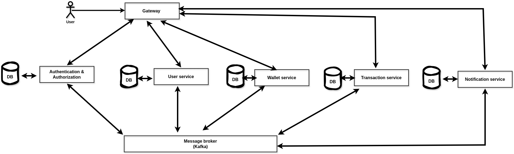
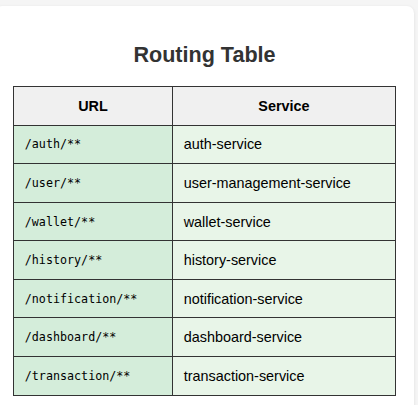

# TheMoneyWallet[TheMMPay]
The Money wallet is an app that lets you pay, send,accept payment and keep track of your payment Using the java and java spring framework :)

---
# Gateway service
I use [Spring Cloud Gateway](https://spring.io/projects/spring-cloud-gateway) It creates a single entry point for the application, streamlining API routing, ensuring robust security, monitoring performance, and enhancing resiliency.

For example this is how the gateway only allow the requests with the right permisions to access the internal services.

# Authentication service 
Implemented authentication in Spring Boot microservices using [Spring Security](https://spring.io/projects/spring-security), [JWT](https://en.wikipedia.org/wiki/JSON_Web_Token). Signup uses event-driven communication to User Management service (via [Kafka](https://kafka.apache.org/)). Signin returns refresh token in HTTP-only cookie and access token in headers; supports secure logout and token refresh endpoint. Optimized with stateless sessions and cookie flags (HttpOnly, Secure, SameSite).

# User Managment service 
Developed a User Management microservice in Spring Boot with REST endpoints for complete user lifecycle operations (/signup, /updateuser, /getbyemail, etc.). Implemented event-driven architecture using Kafka for consuming UserSignUpEvent and producing events to other services. Built with a layered architecture (Controller, Service, Repository) following microservices best practices for scalability and maintainability.

# Wallet service 

# Transaction service 

# History service

# Notification service

