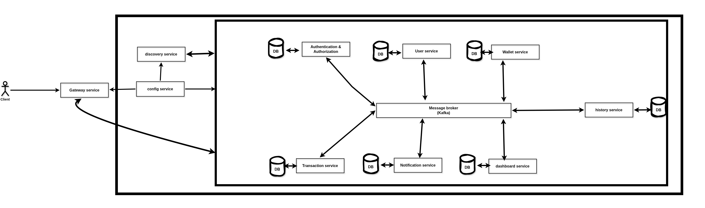
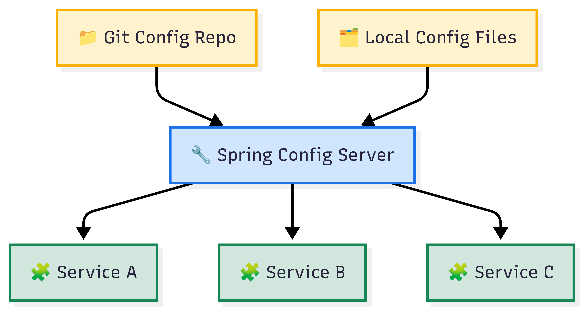

# TheMoneyWallet[TheMMPay]
The Money wallet is an app that lets you pay, send,accept payments and keep track of your payments Using the java and java spring framework :)

---
# **Architecture Overview**

This project implements a microservices-based, cloud-native architecture with event-driven communication.
It is designed to be scalable, maintainable, and resilient for enterprise-grade backends.

**Microservices**: [Gateway Service](#gateway-service) · [Discovery Service](#discovery-service) · [Config Service](#config-service) · [Authentication Service](#authentication-service) · [User Management Service](#user-management-service) · [Wallet Service](#wallet-service) · [Transaction Service](#transaction-service) · [History Service](#history-service) · [Notification Service](#notification-service) · [Dashboard Service](#dashboard-service)

**Service Discovery**: Managed using [Eureka](https://spring.io/projects/spring-cloud-netflix) to enable dynamic service registration.

**API Gateway**: A single entry point is provided by [Spring Cloud Gateway](https://spring.io/projects/spring-cloud-gateway) for routing and load balancing.

**Event-Driven Architecture**: [Apache Kafka](https://kafka.apache.org/) is used to enable asynchronous messaging and decoupled service communication.

**Centralized Configuration**: Handled through [Spring Cloud Config](https://spring.io/projects/spring-cloud-config) to ensure environment consistency.

**Security**: Implemented using [JWT](https://jwt.io/introduction) and [Spring Security OAuth2](https://docs.spring.io/spring-security/reference/servlet/oauth2/login/index.html).

**Persistence Layer**:  
- [MySQL](https://dev.mysql.com/doc/) for transactional data ,[Redis](https://redis.io/docs/) for caching ,[ClickHouse](https://clickhouse.com/docs/en/) for analytics

**Containerization**: All services are containerized using [Docker](https://docs.docker.com/).

## Tech Stack
---

**Frameworks**:  
- [Spring Boot](https://spring.io/projects/spring-boot)  
- [Spring Web](https://docs.spring.io/spring-framework/docs/current/reference/html/web.html)  
- [Spring Security](https://spring.io/projects/spring-security) 
- [Spring Data JPA](https://spring.io/projects/spring-data-jpa)  
- [Spring Boot Actuator](https://docs.spring.io/spring-boot/docs/current/actuator-api/html/)  

**Microservices & Cloud**:  
- [Spring Cloud Config](https://spring.io/projects/spring-cloud-config) (Native Config Server / Client)  
- [Spring Cloud Netflix Eureka](https://spring.io/projects/spring-cloud-netflix)  
- [Spring Cloud Gateway](https://spring.io/projects/spring-cloud-gateway)  
- [Spring Cloud LoadBalancer](https://docs.spring.io/spring-cloud-commons/docs/current/reference/html/#spring-cloud-loadbalancer)  

**Asynchronous Messaging**:  
- [Apache Kafka](https://kafka.apache.org/)  
- [Spring for Apache Kafka](https://spring.io/projects/spring-kafka)  

**Authentication & Authorization**:  
- [JWT (JSON Web Token)](https://jwt.io/introduction)  
- [Spring Security OAuth2 Client](https://docs.spring.io/spring-security/reference/servlet/oauth2/login/index.html)  

**Persistence & Caching**:  
- [MySQL](https://dev.mysql.com/doc/)  
- [Redis](https://redis.io/docs/)  
- [ClickHouse](https://clickhouse.com/docs/en/)  

**Development & Testing Tools**:  
- [Spring Boot DevTools](https://docs.spring.io/spring-boot/docs/current/reference/html/using.html#using.devtools)  
- [Spring Boot Starter Test](https://docs.spring.io/spring-boot/docs/current/reference/html/features.html#features.testing)

## Gateway service
This project uses [Spring Cloud Gateway](https://spring.io/projects/spring-cloud-gateway) It creates a single entry point for the application, streamlining API routing, ensuring robust security, monitoring performance, and enhancing resiliency.

For example this is how the gateway only allow the requests with the right permisions to access the internal services.

# Discovery service

This project uses [Spring Cloud Netflix Eureka](https://spring.io/projects/spring-cloud-netflix) for service discovery, allowing microservices to register and locate each other dynamically. It eliminates hardcoded service URLs, supports client-side load balancing, and improves scalability and fault tolerance in a distributed architecture.

# Config service

This project uses  [Spring Cloud Config](https://docs.spring.io/spring-cloud-config/docs/current/reference/html/) To externalize and centralize configuration management across microservices, ensuring consistency, reducing duplication, and enabling dynamic updates without redeployments. This improves scalability, maintainability, and environment-specific flexibility.

# Authentication service 

This service handles authentication and authorization for the microservices ecosystem using [Spring Security](https://spring.io/projects/spring-security), [JWT](https://en.wikipedia.org/wiki/JSON_Web_Token), [OAuth2](https://spring.io/guides/tutorials/spring-boot-oauth2) standards. It provides endpoints like : ***/signup, /signin, /refreshtoken, /logout, /forgotpassword, /verifytoken, and /verifyemail*** . Each critical action publishes domain events via [Kafka](https://kafka.apache.org/) (UserRegistered, UserLoggedIn, TokenRefreshed, etc.), enabling other services to react asynchronously and remain loosely coupled. Centralizing auth improves security, consistency, and token lifecycle control, while keeping each microservice focused on its domain logic.This modular design simplifies future scaling, auditing, and policy enforcement in distributed systems.

Example of auth flow.

# User Management service
This **User Management Service** is built with [Java](https://www.oracle.com/java/) and [Spring Boot](https://spring.io/projects/spring-boot), providing essential user profile operations such as retrieving, updating, and deleting the authenticated user’s profile, along with fetching other users’ profiles by username (`/profile`, `/user/userName`).

It leverages [Spring Data JPA](https://spring.io/projects/spring-data-jpa) with [MySQL](https://www.mysql.com/) for persistence, [Spring Security](https://spring.io/projects/spring-security) with [JWT](https://en.wikipedia.org/wiki/JSON_Web_Token) for secure authentication and authorization, and [Apache Kafka](https://kafka.apache.org/) for event-driven messaging.

The service incorporates [Spring Cloud Config](https://spring.io/projects/spring-cloud-config) for centralized configuration, [Eureka Client](https://spring.io/projects/spring-cloud-netflix) for service discovery, and [ModelMapper](https://modelmapper.org/) for efficient DTO mapping.

Development is streamlined with [Lombok](https://projectlombok.org/), [Spring Boot DevTools](https://docs.spring.io/spring-boot/docs/current/reference/html/using.html#using.devtools), and [Spring Boot Actuator](https://docs.spring.io/spring-boot/docs/current/reference/html/actuator.html) for monitoring, while [OpenAPI (Swagger)](https://swagger.io/specification/) ensures comprehensive API documentation.

This service emphasizes **scalability**, **security**, and **extensibility** to support future feature additions.

# Wallet Service

**Wallet Service** is a microservice built using [Spring Boot](https://spring.io/projects/spring-boot) for managing user wallets. It provides RESTful APIs to create, retrieve, and update wallet information and balances. The service leverages [Spring Data JPA](https://spring.io/projects/spring-data-jpa) for persistence, [MySQL](https://www.mysql.com/) as the relational database, and [Redis](https://redis.io/) for caching. 

It is integrated with [Kafka](https://kafka.apache.org/) to publish and consume wallet-related events (e.g., creation, balance update, reservation result) and supports asynchronous processing with [Spring WebFlux](https://docs.spring.io/spring-framework/reference/web/webflux.html). Security is handled by [Spring Security](https://spring.io/projects/spring-security), and configuration is centralized via [Spring Cloud Config](https://spring.io/projects/spring-cloud-config). The service registers with [Eureka](https://spring.io/projects/spring-cloud-netflix) for service discovery.

Key endpoints include: [`POST /create` — Create a new wallet ,`GET /{walletId}` — Get wallet by ID,`GET /user/{userId}` — Get all wallets for a user,`PUT /{walletId}/balance` — Update wallet balance,`PUT /{walletId}` — Update wallet details]

---

# Transaction service 
Created Transaction microservice in Spring Boot handling complex financial operations with atomicity guarantees through endpoints (/process, /verify, /reverse). Implemented event-driven architecture using Kafka for transaction event propagation across services. Built with distributed transaction patterns, compensating actions for rollbacks, and comprehensive audit logging for financial compliance.

# History service
Developed History microservice in Spring Boot with comprehensive endpoints (/getactivity, /getbydate, /filter) for tracking user activities and system events. Leveraged Kafka consumers to capture cross-service events for centralized history recording. Implemented efficient querying patterns with pagination and filtering support for optimized performance on large historical datasets.

# Notification service
Built Notification microservice in Spring Boot with multi-channel delivery support (email, SMS, push) through unified REST endpoints (/send, /schedule, /cancel). Implemented Kafka event consumption for triggering notifications based on system events. Designed with template-based message generation, delivery status tracking, and retry mechanisms for reliable notification delivery.

# Dashboard service
Built Notification microservice in Spring Boot with multi-channel delivery support (email, SMS, push) through unified REST endpoints (/send, /schedule, /cancel). Implemented Kafka event consumption for triggering notifications based on system events. Designed with template-based message generation, delivery status tracking, and retry mechanisms for reliable notification delivery.
